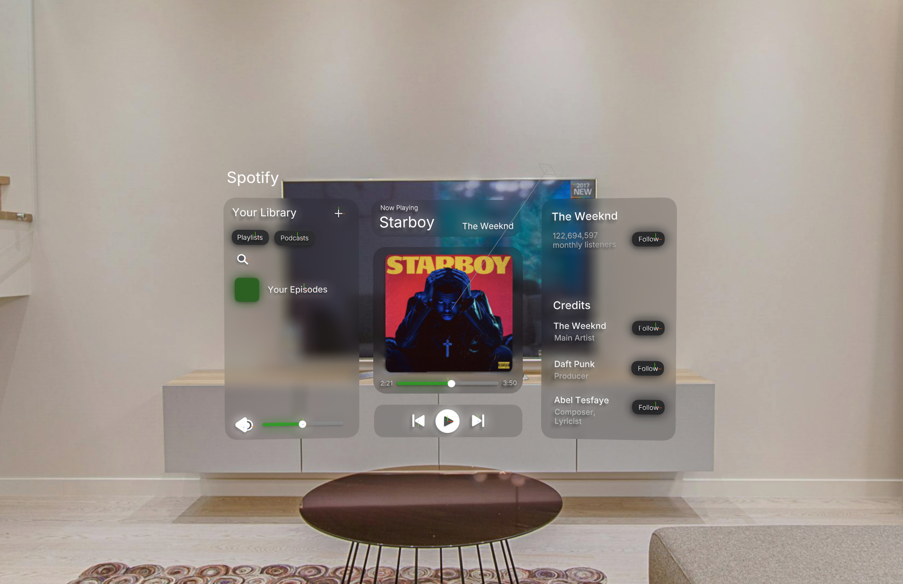

# CodTech-Task4-AR-VR-Music-Player
# Name: Aditya Abnave
# Company: CODTECH IT SOLUTIONS
# ID: CTIS2512
# Domain: UI/UX Design
# Duration: January 7th, 2026 to February 4th, 2026
# Mentor: Neela Santhosh Kumar

## Overview of the Project

### Project: AR/VR Spatial Interface (Music Player)
In Task 4, the objective was to design a user interface for an Augmented Reality (AR) or Virtual Reality (VR) application, focusing on intuitive spatial interactions. I designed a **Spatial Music Player** inspired by glassmorphism and modern mixed-reality design principles (Apple Vision Pro aesthetics).

### Key Features
* **Glassmorphism UI:** Utilized real-time background blurring and transparency to ensure the interface blends naturally into the user's environment.
* **Z-Depth Hierarchy:** Elements like the Album Art and Progress Bar float on different Z-axis layers to create a sense of true 3D depth and volume.
* **Micro-Interactions:** Implemented "Hover" and "Click" states using Spline's event system. Buttons scale up, bounce, and light up when the user interacts with them, providing tactile feedback.
* **Curved Layout:** The interface uses a multi-panel layout (Library, Player, Credits) angled towards the user for better ergonomic visibility in 3D space.
* **Real-World Environment:** Integrated an HDRI background to simulate how the glass materials refract and reflect light in a physical room.

### Tools Used
* **Spline 3D:** For 3D modeling, material design, and interactive prototyping.
* **Spatial Design Principles:** Applied depth, scale, and lighting to ensure readability in a mixed-reality context.

### Project Files
* **[Prototype Demo Video](Demo_Task4.mov)**
* **[Spline Source File](AR_Music_Player.spline)**

## Output
**[3D Prototype](https://my.spline.design/untitled-jOVJK590qpcHoMFNMbgv8ZjT/)**

